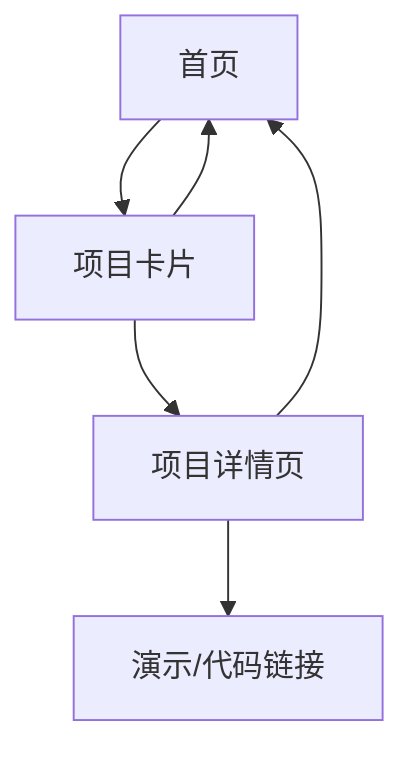

## 1. 产品概述
Kejin AI Lab是一个个人AI项目作品展示网站，旨在展示AI产品经理的技术能力和创新项目。通过现代化的设计风格和交互体验，向访客展示AI原型项目、技术栈和代码成果。

目标用户包括：潜在雇主、合作伙伴、技术同行以及对AI项目感兴趣的人群。产品价值在于建立个人技术品牌，展示AI产品开发能力。

## 2. 核心功能

### 2.1 用户角色
本网站为展示型网站，无需用户注册登录功能。所有内容对访客开放浏览。

### 2.2 功能模块
网站包含以下主要页面：
1. **首页**：英雄区域、统计数据、项目卡片展示、最新思考、联系方式。
2. **项目详情页**：项目详细介绍、技术栈、演示链接、代码仓库链接。

### 2.3 页面详情

| 页面名称 | 模块名称 | 功能描述 |
|---------|---------|---------|
| 首页 | 英雄区域 | 展示网站标题"Building the Future with AI"、副标题介绍、主要CTA按钮 |
| 首页 | 统计数据 | 展示"50+ AI Prototypes"、"100k+ Lines of Code"等关键数据 |
| 首页 | 项目卡片 | 网格布局展示AI项目，包含预览图、项目名称、简短描述、技术标签、查看按钮 |
| 首页 | 最新思考 | 展示最新的技术思考或行业洞察内容 |
| 首页 | 联系方式 | 提供邮箱、LinkedIn等联系方式，包含"Let's Connect"CTA |
| 项目详情页 | 项目信息 | 展示项目完整描述、技术栈详情、开发周期、核心功能 |
| 项目详情页 | 演示区域 | 提供在线演示链接、GitHub仓库链接、技术文档链接 |
| 项目详情页 | 相关项目 | 展示其他相关的AI项目推荐 |

## 3. 核心流程
访客浏览流程：
1. 访问首页 → 浏览英雄区域和统计数据 → 查看项目卡片 → 点击感兴趣的项目 → 进入项目详情页 → 查看演示或代码 → 返回首页或其他项目

## 4. 用户界面设计

### 4.1 设计风格
- **主色调**：深灰色基色（Zinc-950）配合AI主题的紫色/蓝色渐变
- **按钮样式**：现代化圆角设计，悬停时有发光效果
- **字体**：简洁现代的无衬线字体，标题使用较大字号突出层次
- **布局风格**：卡片式布局，顶部固定导航栏
- **图标风格**：使用技术感十足的线条图标和emoji

### 4.2 页面设计概览

| 页面名称 | 模块名称 | UI元素 |
|---------|---------|---------|
| 首页 | 英雄区域 | 深色背景配合紫色渐变标题，大字号标题居中，CTA按钮使用亮色突出 |
| 首页 | 项目卡片 | 网格布局，卡片悬停时有缩放和发光效果，技术标签使用彩色背景 |
| 首页 | 统计数据 | 大数字配合简洁图标，使用对比色突出重要数据 |
| 项目详情页 | 项目信息 | 清晰的标题层级，技术栈使用标签云形式展示 |

### 4.3 响应式设计
采用桌面优先设计，适配移动设备。在移动端优化触摸交互，调整网格布局为单列显示，确保在小屏幕上保持良好的可读性。

### 4.4 交互效果
- 平滑滚动导航
- 卡片悬停缩放和发光效果
- 按钮点击反馈动画
- 滚动时的渐显效果