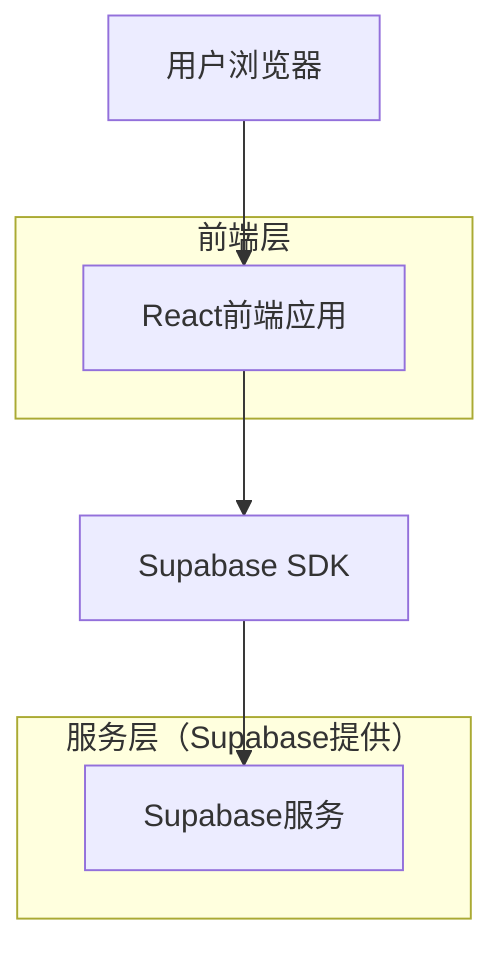
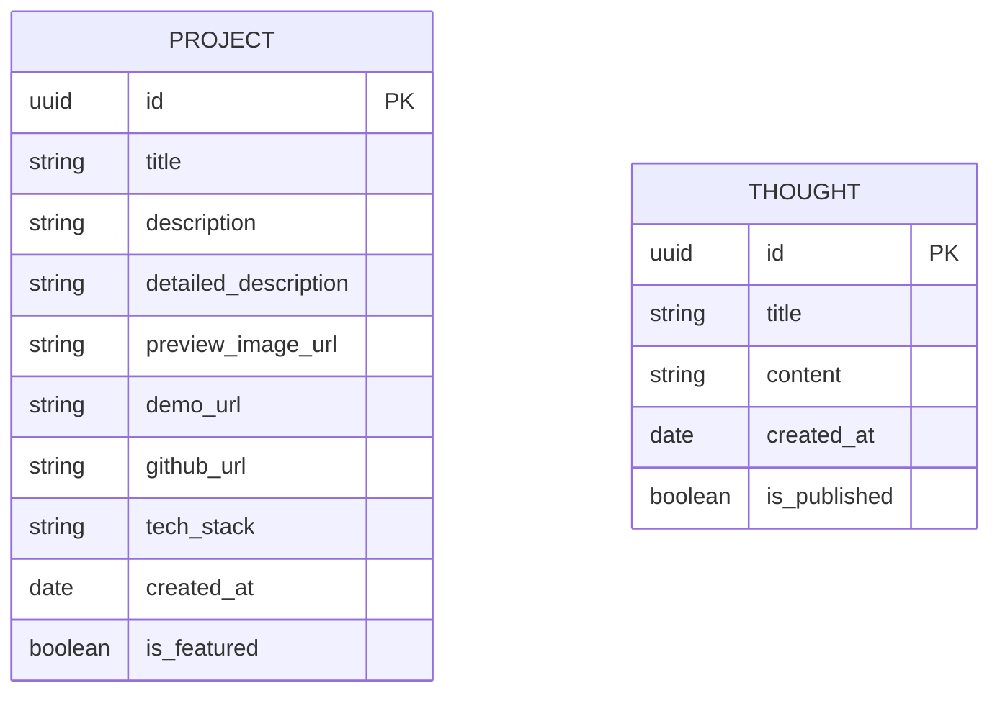
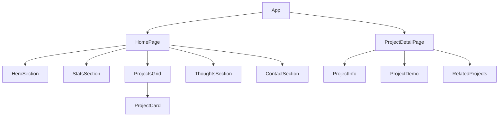

## 1. 架构设计



## 2. 技术描述

* **前端**：React\@18 + TailwindCSS\@3 + Vite

* **初始化工具**：vite-init

* **后端**：Supabase（提供数据库和文件存储）

* **UI组件库**：HeadlessUI（用于交互组件）

* **图标**：Lucide React（技术图标）

## 3. 路由定义

| 路由           | 用途                   |
| ------------ | -------------------- |
| /            | 首页，展示英雄区域、项目卡片、统计数据等 |
| /project/:id | 项目详情页，展示具体项目的详细信息    |

## 4. 数据模型

### 4.1 数据模型定义



### 4.2 数据定义语言

项目表（projects）

```sql
-- 创建项目表
CREATE TABLE projects (
    id UUID PRIMARY KEY DEFAULT gen_random_uuid(),
    title VARCHAR(255) NOT NULL,
    description TEXT NOT NULL,
    detailed_description TEXT,
    preview_image_url VARCHAR(500),
    demo_url VARCHAR(500),
    github_url VARCHAR(500),
    tech_stack TEXT[],
    created_at TIMESTAMP WITH TIME ZONE DEFAULT NOW(),
    is_featured BOOLEAN DEFAULT false,
    display_order INTEGER DEFAULT 0
);

-- 创建思考文章表
CREATE TABLE thoughts (
    id UUID PRIMARY KEY DEFAULT gen_random_uuid(),
    title VARCHAR(255) NOT NULL,
    content TEXT NOT NULL,
    created_at TIMESTAMP WITH TIME ZONE DEFAULT NOW(),
    is_published BOOLEAN DEFAULT true
);

-- 创建索引
CREATE INDEX idx_projects_featured ON projects(is_featured);
CREATE INDEX idx_projects_order ON projects(display_order DESC);
CREATE INDEX idx_thoughts_published ON thoughts(is_published);
CREATE INDEX idx_thoughts_created ON thoughts(created_at DESC);

-- 设置访问权限
GRANT SELECT ON projects TO anon;
GRANT SELECT ON thoughts TO anon;
GRANT ALL ON projects TO authenticated;
GRANT ALL ON thoughts TO authenticated;
```

### 4.3 初始数据

```sql
-- 插入示例项目数据
INSERT INTO projects (title, description, detailed_description, preview_image_url, demo_url, github_url, tech_stack, is_featured, display_order) VALUES
('AI代码助手', '基于GPT的智能代码生成工具', '使用React和FastAPI构建的AI代码助手，支持多种编程语言的智能代码补全和生成功能', 'https://example.com/ai-coder.jpg', 'https://demo.kejin-ai.com/ai-coder', 'https://github.com/kejin/ai-coder', '{"React", "FastAPI", "OpenAI", "PostgreSQL"}', true, 1),
('智能数据分析平台', '自动化数据洞察和可视化平台', '集成机器学习的自动化数据分析平台，能够快速识别数据模式和趋势', 'https://example.com/data-viz.jpg', 'https://demo.kejin-ai.com/data-viz', 'https://github.com/kejin/data-viz', '{"Vue.js", "Python", "TensorFlow", "D3.js"}', true, 2);

-- 插入思考文章
INSERT INTO thoughts (title, content) VALUES
('AI产品设计的未来趋势', '随着大语言模型的发展，AI产品设计正在经历革命性的变化...'),
('如何评估AI项目的商业价值', '在AI项目开发中，技术可行性只是第一步，更重要的是商业价值评估...');
```

## 5. 组件架构

### 5.1 主要组件结构



### 5.2 状态管理

使用React Context API管理全局状态：

* 项目数据状态

* 加载状态

* 错误处理状态

### 5.3 文件结构

```
src/
├── components/
│   ├── common/
│   │   ├── Header.jsx
│   │   ├── Footer.jsx
│   │   └── Button.jsx
│   ├── home/
│   │   ├── HeroSection.jsx
│   │   ├── StatsSection.jsx
│   │   ├── ProjectsGrid.jsx
│   │   └── ThoughtsSection.jsx
│   └── project/
│       ├── ProjectInfo.jsx
│       └── ProjectDemo.jsx
├── pages/
│   ├── HomePage.jsx
│   └── ProjectDetailPage.jsx
├── hooks/
│   ├── useProjects.js
│   └── useThoughts.js
├── utils/
│   └── supabase.js
└── styles/
    └── globals.css
```

